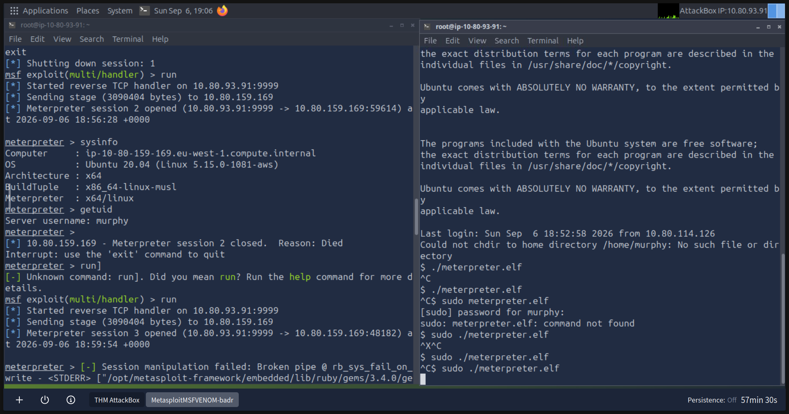
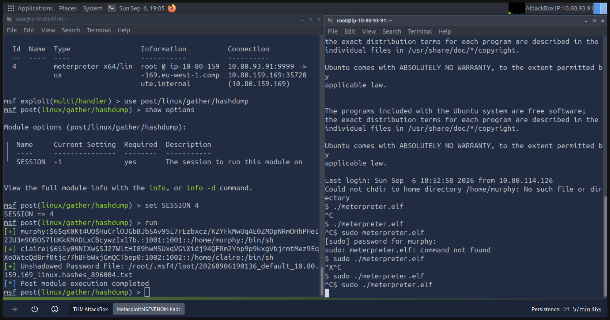

# Metasploit Exploitation & Meterpreter Lab

## Overview

I completed the Metasploit: Exploitation room on TryHackMe to develop practical experience using the Metasploit Framework for exploitation and post-exploitation tasks.

During the lab, I used Metasploit modules against deliberately vulnerable target machines, generated a Meterpreter payload using `msfvenom`, configured a reverse TCP handler and established a Meterpreter session.

I also encountered an issue where my Meterpreter session repeatedly terminated shortly after connecting. Troubleshooting this became an important part of the lab and gave me additional experience diagnosing problems rather than simply following the room instructions.

## Tools Used

- TryHackMe
- Metasploit Framework
- Metasploit Console (`msfconsole`)
- `msfvenom`
- Meterpreter
- Linux command line

## Lab Process

### 1. Working with Metasploit

I used the Metasploit Framework to search for and configure modules appropriate for the target systems provided by TryHackMe.

This involved becoming more familiar with the general Metasploit workflow, including selecting modules, reviewing their required options and configuring parameters before execution.

### 2. Generating a Meterpreter Payload

As part of the lab, I generated a Linux Meterpreter reverse TCP payload using `msfvenom`.

The payload was saved as `meterpreter.elf`.

Generating the payload helped me understand the relationship between the payload running on the target and the listener running on the attacking system.

### 3. Configuring the Reverse TCP Handler

After generating the payload, I configured Metasploit to listen for the reverse connection.

The handler needed to use settings compatible with those used when the payload was generated.

Once the payload executed on the target system, it attempted to establish a connection back to the Metasploit listener.

### 4. Troubleshooting the Meterpreter Session

Initially, the Meterpreter session opened successfully but terminated shortly afterwards.

I was able to run commands such as `sysinfo` and `getuid`.

This confirmed that the payload and reverse handler were capable of successfully establishing a Meterpreter session.

However, the session later terminated with messages including `Reason: Died` and `Broken pipe`.

I checked the payload and handler configuration while troubleshooting the issue.

I eventually identified that the TryHackMe target environment was being reset when I moved between parts of the lab environment. Because the Meterpreter payload process was running on the target, resetting the target also terminated the process and caused the Meterpreter session to die.

After correcting how I interacted with the lab environment, I was able to maintain a stable Meterpreter session.

This was one of the most useful parts of the exercise because it required me to distinguish between a problem with my Metasploit configuration and a problem caused by the lab environment.

#### Evidence – Meterpreter Session Troubleshooting

The screenshot below shows a Meterpreter session successfully opening and allowing me to run `sysinfo` and `getuid` before the session unexpectedly terminates.

This helped confirm that the payload and reverse handler were functioning correctly and shifted my troubleshooting towards understanding why the established session was being terminated.

### 5. Meterpreter Post-Exploitation

Once I had a stable Meterpreter session, I explored the post-exploitation capabilities available through Metasploit.

I used the post-exploitation module `post/linux/gather/hashdump`.

I selected the active Meterpreter session, configured the module to use that session and then executed it successfully.

The module retrieved password hashes from the deliberately vulnerable TryHackMe target system.

This demonstrated how gaining initial access to a machine is only one stage of an attack and how an attacker may attempt to gather additional information after compromise.

#### Evidence – Linux Hash Extraction

The screenshot below shows the active Meterpreter session and the successful execution of the Linux hashdump post-exploitation module.

The module extracted password hashes for user accounts on the deliberately vulnerable target machine.

## Troubleshooting Process

When the Meterpreter session repeatedly terminated, I worked through the problem rather than repeatedly recreating the payload without understanding the cause.

My troubleshooting process involved:

1. Confirming that the Meterpreter payload executed successfully.
2. Confirming that the Metasploit reverse TCP handler received the connection.
3. Observing that a Meterpreter session was successfully created.
4. Running `sysinfo` and `getuid` to verify that the session was functional.
5. Identifying that the session only terminated after interacting with another part of the TryHackMe environment.
6. Checking the target machine and noticing that its state had changed.
7. Determining that the target environment was resetting and terminating the running payload.
8. Repeating the process while keeping the target environment active.
9. Confirming that the Meterpreter session remained stable.
10. Successfully running the post-exploitation hashdump module.

This helped me practise separating configuration problems from environmental problems during troubleshooting.

## Security Perspective

The lab also helped me understand Metasploit from a defensive cybersecurity perspective.

A reverse Meterpreter payload creates a connection from the compromised system back to an attacker-controlled listener.

Once established, the session can provide capabilities for interacting with the target and performing post-exploitation activity.

From a defensive perspective, this reinforces why unusual outbound connections, unexpected executable files, suspicious processes and credential-access activity can be important indicators during an investigation.

Understanding how offensive tools operate gives me more context for recognising the behaviour they may produce when analysing security events from a defensive perspective.

## Skills Practised

- Metasploit Framework
- Metasploit module configuration
- `msfvenom` payload generation
- Reverse TCP connections
- Meterpreter
- Payload and handler configuration
- Post-exploitation
- Password hash extraction
- Linux command-line usage
- Technical troubleshooting
- Root-cause analysis
- Offensive security fundamentals
- Understanding attacker behaviour from a defensive perspective

## What I Learned

The lab helped me understand the overall workflow between exploitation, payload execution, reverse connections and post-exploitation activity.

The most valuable part of the exercise was troubleshooting the unstable Meterpreter session.

Initially, the session terminating suggested that something might have been wrong with my payload or handler configuration. Investigating the behaviour showed that the TryHackMe target environment was actually being reset, which terminated the payload process.

This reinforced the importance of checking the environment and observing exactly when a problem occurs rather than immediately assuming that the configuration is incorrect.

I also developed a better understanding of what happens after an attacker gains an initial foothold on a system.

Using Meterpreter and post-exploitation modules demonstrated how access can be used to gather further information from a compromised machine.

For someone working towards defensive cybersecurity and SOC roles, understanding this attack process provides useful context when investigating suspicious processes, network connections and credential-access activity.

## Disclaimer

This activity was completed entirely within TryHackMe's controlled lab environment for educational purposes.
