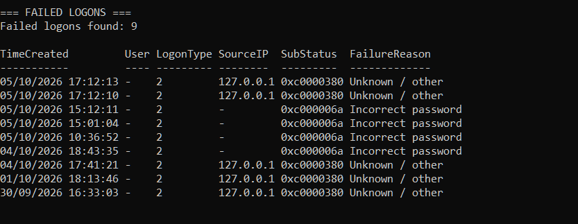
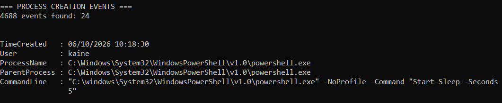
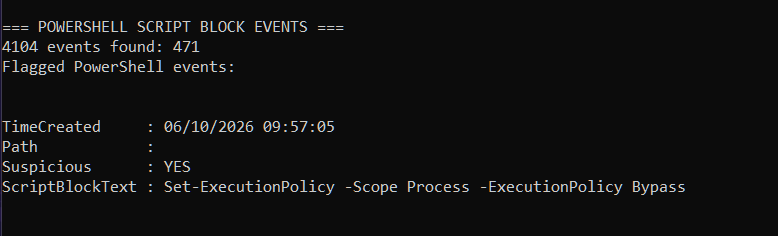

# SecurityTriage PowerShell Tool

A PowerShell-based Windows security triage script created to collect, summarise and surface useful Windows security events for initial investigation.

The project was built as a hands-on exercise in Windows event analysis, PowerShell scripting and SOC-style triage.

## Features

The script currently reviews three types of Windows security telemetry:

### Event ID 4625 - Failed Logons

Collects failed logon events from the Windows Security log and extracts:

- Time of the event
- Target username
- Logon type
- Source IP address
- SubStatus code
- Human-readable failure reason

Common failure codes are translated into readable values such as:

- Incorrect password
- User does not exist
- Account locked out

The script currently reviews the previous 7 days of failed-logon activity.

### Event ID 4688 - Process Creation

Collects process creation events from the Windows Security log and extracts:

- Time created
- User
- Process name
- Parent process
- Command line

This helps provide context around how a process was launched and what arguments were supplied.

The script currently reviews the previous 24 hours of process activity.

### Event ID 4104 - PowerShell Script Block Logging

Collects PowerShell Script Block Logging events and extracts:

- Time created
- Script path
- Script block contents

A simple keyword-based triage check highlights script blocks containing terms such as:

- `Invoke-WebRequest`
- `Invoke-Expression`
- `IEX`
- `EncodedCommand`
- `ExecutionPolicy`
- `DownloadString`

Only events matching the configured triage keywords are displayed in the detailed output.

A keyword match means that an event may be worth reviewing. It does **not** mean that the activity is malicious.

## Administrator Check

The script checks whether it is running with Administrator privileges before attempting to query the Windows Security log.

If it is not elevated, the script stops and asks the user to run it as Administrator.

## Requirements

- Windows 10 or Windows 11
- Windows PowerShell
- Administrator privileges
- Relevant Windows audit logging enabled

### Process Creation Auditing

Event ID 4688 requires Process Creation auditing.

This can be checked with:

```powershell
auditpol /get /subcategory:"Process Creation"
```

To enable successful process creation auditing in a lab environment:

```powershell
auditpol /set /subcategory:"Process Creation" /success:enable
```

### Command-Line Logging

To populate the command-line field in Event ID 4688, enable:

**Local Group Policy Editor**

`Computer Configuration → Administrative Templates → System → Audit Process Creation → Include command line in process creation events`

Set the policy to **Enabled**.

### PowerShell Script Block Logging

Event ID 4104 requires PowerShell Script Block Logging to be available in the environment.

The relevant log is:

```text
Microsoft-Windows-PowerShell/Operational
```

## Usage

Open PowerShell as Administrator, navigate to the project folder and run:

```powershell
.\SecurityTriage.ps1
```

The script displays separate sections for:

1. Failed logons
2. Process creation
3. PowerShell script block activity

## Error Handling

The script uses `try/catch` blocks when querying Windows Event Logs.

This avoids silently hiding query failures and allows the script to distinguish between:

- no matching events being present
- a genuine problem querying the log

## Example Investigation Workflow

The output is intended to support initial triage rather than provide a final security verdict.

A typical investigation could follow:

1. Identify the user and time involved.
2. Review the source of the activity.
3. Examine process and parent-process relationships.
4. Review command-line arguments.
5. Check PowerShell activity around the same time.
6. Correlate findings with other available logs or network evidence.
7. Decide whether the activity is benign, suspicious or requires further investigation.

## Example Output

### Failed Logon Analysis - Event ID 4625

The script parses failed logon events and translates common SubStatus values into readable failure reasons.



### Process Creation - Event ID 4688

Process creation events include the process, parent process and command-line arguments when the relevant Windows audit settings are enabled.



### PowerShell Script Block Triage - Event ID 4104

PowerShell Script Block Logging is reviewed against a small set of triage keywords. A match highlights activity for investigation but does not automatically classify it as malicious.



## Limitations

This is a learning and triage tool, not a replacement for a SIEM, EDR platform or production detection system.

Important limitations include:

- Keyword matching can produce false positives.
- A flagged PowerShell command is not automatically malicious.
- The quality of the output depends on the Windows audit policies enabled on the host.
- Historical events will not contain telemetry that was not enabled when the event originally occurred.
- Additional evidence should be reviewed before reaching an incident conclusion.

## Skills Demonstrated

- PowerShell scripting
- Windows Event Logs
- `Get-WinEvent`
- XML event parsing
- Windows auditing
- Process investigation
- Parent-child process analysis
- Command-line analysis
- PowerShell Script Block Logging
- Error handling
- SOC triage methodology

## Project Status

The script is functional and may be expanded in future with features such as:

- Event counts and summaries
- Additional security event IDs
- Report export
- Improved filtering
- Timeline correlation