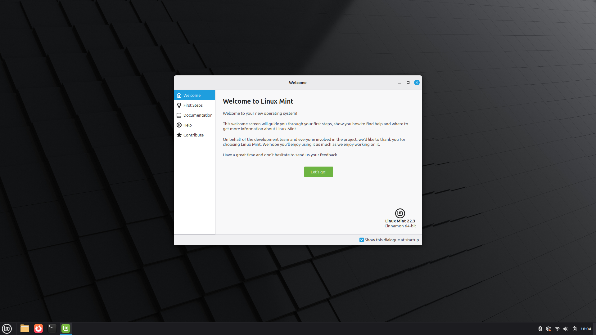
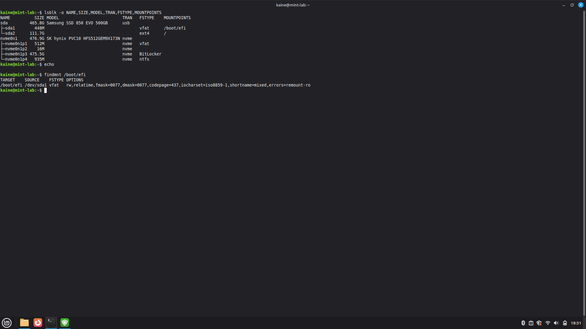
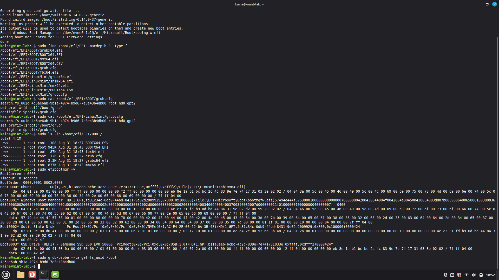
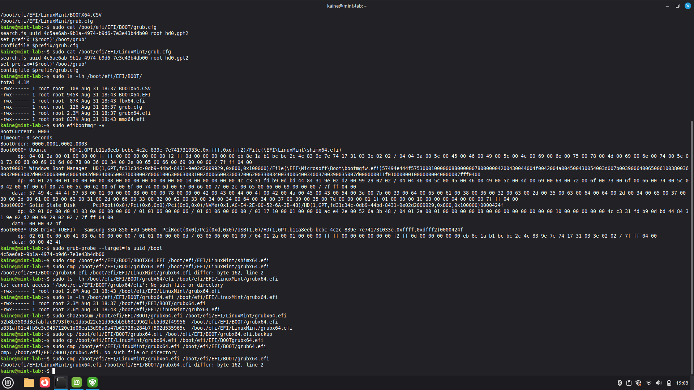
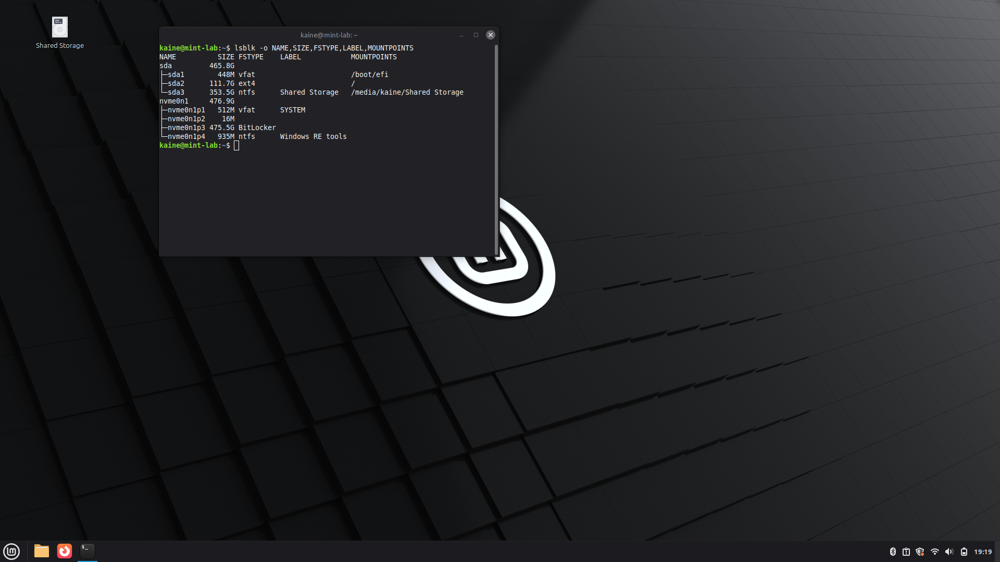
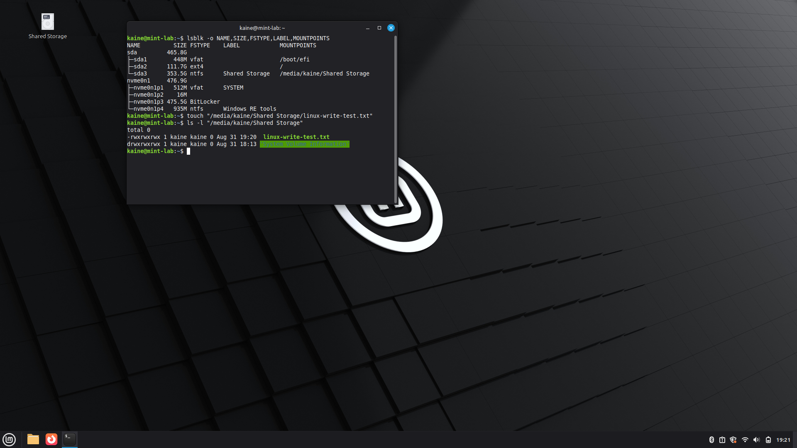
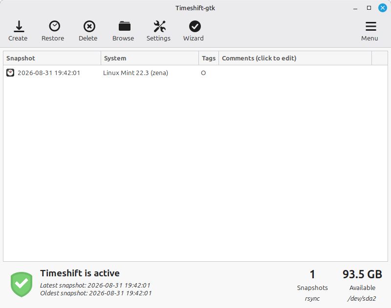

# External Linux Mint Workstation & UEFI/GRUB Troubleshooting

## Project Overview

I repurposed a Samsung 850 EVO 500GB SATA SSD from an old gaming PC into a portable Linux workstation using a USB enclosure.

The goal was to create a Linux environment that could boot independently from my laptop's internal Windows drive while also providing shared storage accessible from both Linux and Windows.

This project involved:

- Checking the health of a previously used SSD before reuse
- Removing the previous Windows installation
- Installing Linux Mint 22.3 Cinnamon
- Manually partitioning the SSD for Linux and cross-platform storage
- Configuring an independent EFI System Partition
- Diagnosing and repairing a GRUB/UEFI boot issue
- Creating an NTFS shared-storage partition
- Configuring Timeshift system snapshots
- Updating and preparing Linux for future IT and cybersecurity labs
- Configuring Git and SSH access to GitHub

## Hardware & Storage Layout

The external drive is a Samsung 850 EVO 500GB SATA SSD connected to the laptop through a USB enclosure.

Before installation, I checked the SSD's SMART information to verify that there were no reallocated sectors, uncorrectable errors or other immediate indicators of drive failure.

The final external SSD layout was:

| Partition | Approx. Size | Filesystem | Purpose |
|---|---:|---|---|
| EFI System Partition | 448 MB | FAT32 | Independent UEFI boot files |
| Linux Mint | 112 GB | ext4 | Linux operating system and applications |
| Shared Storage | 354 GB | NTFS | Files accessible from Linux and Windows |

The laptop's internal NVMe SSD containing Windows was left intact.

## Installation

I installed Linux Mint 22.3 Cinnamon onto the external SSD.

The Linux root filesystem was installed on the external ext4 partition. However, after installation I discovered that the system's EFI mount point (`/boot/efi`) was using the laptop's internal NVMe EFI System Partition rather than the EFI partition on the external SSD.

I identified the mounted partitions using commands including:

```bash
lsblk -o NAME,SIZE,MODEL,TRAN,FSTYPE,MOUNTPOINTS
findmnt /boot/efi
```

This confirmed that Linux itself was installed on the external SSD, but its EFI configuration was still dependent on the internal drive.

## UEFI/GRUB Boot Troubleshooting

### Problem

My objective was for the external SSD to be independently bootable without relying on the laptop's internal Windows drive.

I created and formatted an EFI System Partition on the external SSD and installed GRUB to it.

The HP UEFI boot menu successfully detected the external Samsung SSD as a bootable USB device. However, selecting it initially loaded only a GRUB command prompt:

```text
grub>
```

rather than the normal GRUB boot menu.

### Investigation

I used the GRUB command line to inspect the available disks and partitions.

The external Linux root filesystem was identified as:

```text
(hd0,gpt2)
```

I verified that it contained the expected Linux filesystem, including `/boot`, `/etc` and the other system directories.

I was then able to manually load the installed GRUB configuration from the Linux partition. This successfully displayed the normal GRUB menu and allowed Linux Mint to boot.

This demonstrated that:

- The Linux installation itself was working
- The root filesystem was accessible
- The main GRUB configuration was valid
- The problem was specifically within the automatic EFI-to-GRUB boot chain

### EFI Repair

I installed GRUB onto the external EFI System Partition and configured `/etc/fstab` so `/boot/efi` referenced the external EFI partition rather than the internal Windows EFI partition.

I regenerated the GRUB configuration:

```bash
sudo update-grub
```

I also inspected the EFI boot files and used `efibootmgr` to verify that the firmware recognised the external Samsung SSD as a UEFI boot device.

The external EFI partition contained both the standard Linux Mint loader and the fallback UEFI boot path under:

```text
EFI/LinuxMint/
EFI/BOOT/
```

Despite this, the fallback USB boot path continued to open the GRUB command prompt.

### Root Cause Investigation

I compared the GRUB EFI binaries used by the fallback and Linux Mint boot paths:

```bash
sudo cmp /boot/efi/EFI/BOOT/grubx64.efi /boot/efi/EFI/LinuxMint/grubx64.efi
```

The binaries differed.

Before making any change, I created a backup of the existing fallback GRUB binary. I then replaced it with the working Linux Mint GRUB EFI binary and verified that the two files matched.

After the change, I performed a cold-boot test and manually selected the external Samsung SSD from the laptop's UEFI boot menu.

The system successfully loaded the normal GRUB menu and booted Linux Mint from the external SSD.

## Shared Storage

The remaining space on the SSD was configured as an NTFS partition labelled `Shared Storage`.

NTFS was chosen so that the same storage could be accessed from both Windows and Linux.

Windows Fast Startup/hibernation was disabled to reduce the risk of Windows leaving NTFS volumes in a hibernated state before they are accessed from Linux.

Linux Mint successfully detected and mounted the shared partition.

## System Preparation

After installation and boot troubleshooting were complete, I updated the system packages and installed several tools for future Linux, IT support and cybersecurity labs.

These included:

- Git
- curl
- wget
- htop
- tree
- net-tools
- OpenSSH client

I also configured Timeshift using RSYNC snapshots to provide a recovery point before making significant future system changes.

## GitHub Configuration

Git was configured on the new Linux environment and SSH authentication was set up for GitHub.

An SSH key pair was generated and the public key was added to my GitHub account.

I verified that authentication was working and cloned/accessed my existing cybersecurity portfolio from Linux.

This allows future lab work to be documented and pushed directly from the Linux workstation.

## Verification

After completing the configuration, I verified the final storage layout using:

```bash
lsblk -o NAME,SIZE,FSTYPE,LABEL,MOUNTPOINTS
```

The external SSD contained:

- `/dev/sda1` — FAT32 EFI System Partition mounted at `/boot/efi`
- `/dev/sda2` — ext4 Linux Mint root filesystem mounted at `/`
- `/dev/sda3` — NTFS `Shared Storage` partition accessible from Linux and Windows

A cold boot confirmed that the external SSD could be selected through the UEFI boot menu and successfully start Linux Mint.

## Skills Demonstrated

This project provided practical experience with:

- Linux installation and configuration
- SSD health assessment using SMART data
- GPT disk partitioning
- FAT32, ext4 and NTFS filesystems
- UEFI boot processes
- EFI System Partitions
- GRUB installation and troubleshooting
- Linux filesystem mounting
- `/etc/fstab` configuration
- Command-line troubleshooting
- Comparing files using `cmp`
- Using `lsblk`, `findmnt`, `blkid` and `efibootmgr`
- Cross-platform storage configuration
- Linux package management
- Timeshift system recovery
- Git and SSH configuration
- Testing and verifying changes before considering a problem resolved

## Key Lessons

The most important part of this project was troubleshooting the boot process rather than simply reinstalling Linux when the external SSD failed to boot correctly.

By separating the problem into stages, I established that the Linux installation, root filesystem and main GRUB configuration were functioning correctly. This narrowed the issue down to the EFI/GRUB boot chain.

I also learned the importance of verifying which physical disk an EFI System Partition belongs to. Although Linux itself had been installed to the external SSD, the initial configuration still depended on the internal drive's EFI partition.

Finally, I used backups and verification commands before making changes to boot files. This provided a recovery path and reduced the risk of turning a boot problem into an unbootable installation.

## Evidence

The following screenshots document key stages and verification checks from the project.

### Linux Mint Installation



*Linux Mint 22.3 Cinnamon running after installation to the external SSD.*

### External EFI Verification



*Using `lsblk` and `findmnt` to verify that the Linux root filesystem and `/boot/efi` are located on the external SSD.*

### UEFI and GRUB Investigation



*Inspecting GRUB configuration files, EFI boot entries and filesystem UUID information while troubleshooting the external boot process.*

### GRUB EFI Binary Investigation



*Comparing the fallback and Linux Mint GRUB EFI binaries during investigation of the external boot failure.*

### Final SSD Layout



*Final partition layout showing the FAT32 EFI partition mounted at `/boot/efi`, the ext4 Linux root filesystem, and the NTFS Shared Storage partition.*

### Cross-Platform Shared Storage Test



*Creating a test file on the NTFS Shared Storage partition from Linux to verify write access.*

### Timeshift Recovery



*Timeshift configured and a recovery snapshot successfully created after completing the workstation setup.*

