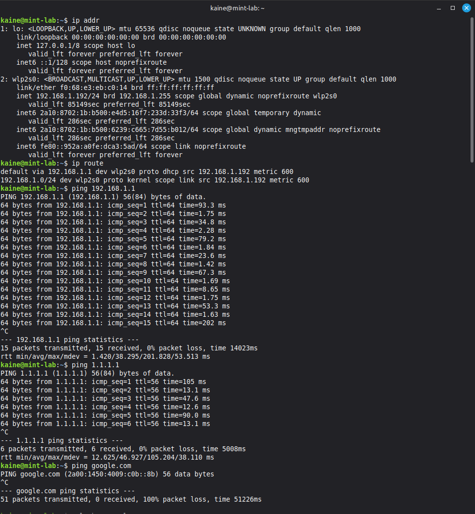
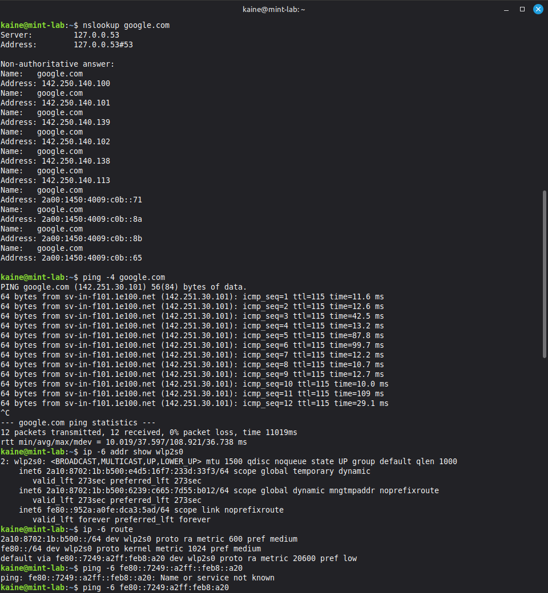
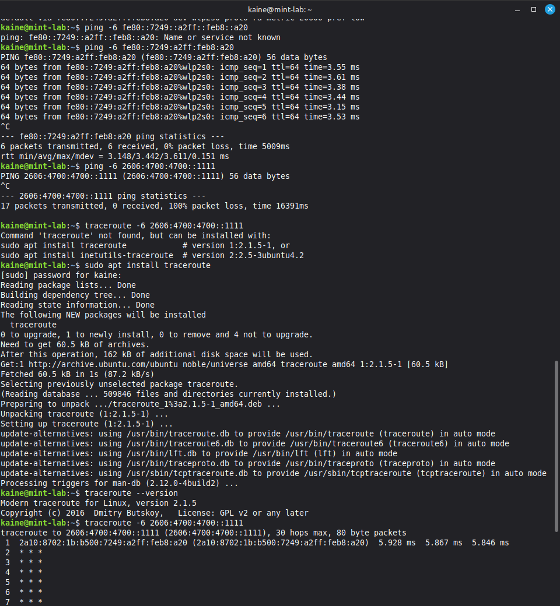

# Linux Network Troubleshooting Lab

## Project Overview

This project documents a network troubleshooting investigation performed from my Linux Mint workstation.

The investigation began by reviewing the workstation's basic network configuration and developed into diagnosing an unexpected IPv6 connectivity issue.

Rather than immediately changing network settings, I used a structured troubleshooting process to test each part of the connection and narrow down where the problem was occurring.

The investigation covered:

- Network interfaces
- IPv4 and IPv6 addressing
- Default gateways
- Routing tables
- Local network connectivity
- External connectivity
- DNS resolution
- IPv4 vs IPv6 testing
- Traceroute
- Fault isolation

## Network Interface Investigation

I started by examining the workstation's network interfaces:

```bash
ip addr
```

The active wireless interface was:

```text
wlp2s0
```

The workstation had the IPv4 address:

```text
192.168.1.192/24
```

I also identified the loopback interface `lo`. The loopback interface allows the system to communicate with itself and uses addresses including `127.0.0.1` for IPv4 and `::1` for IPv6.

## Routing and Default Gateway

I examined the IPv4 routing table:

```bash
ip route
```

The default gateway was:

```text
192.168.1.1
```

Traffic to the gateway used the wireless `wlp2s0` interface.

This established the basic network path:

```text
Linux workstation
        ↓
Wireless interface
        ↓
Default gateway/router
        ↓
External networks
```

## Testing Local Connectivity

I tested connectivity to the default gateway:

```bash
ping 192.168.1.1
```

The test returned:

```text
0% packet loss
~38 ms average latency
```

This demonstrated that the workstation could communicate successfully with the local router.

At this stage, changing the Wi-Fi configuration would not have been justified because local connectivity was functioning.

## Testing External IPv4 Connectivity

I then tested an external IPv4 address:

```bash
ping 1.1.1.1
```

The test succeeded with 0% packet loss.

Because this test used an IP address directly, it demonstrated that external IPv4 connectivity was working without relying on DNS name resolution.

The results at this stage were:

```text
Local network connectivity     PASS
Default gateway connectivity   PASS
External IPv4 connectivity     PASS
```

## DNS Investigation

I tested hostname resolution using:

```bash
ping google.com
```

and:

```bash
nslookup google.com
```

`nslookup` successfully returned multiple IPv4 and IPv6 addresses for Google.

The DNS server displayed by the workstation was:

```text
127.0.0.53
```

This is the local `systemd-resolved` stub resolver, which accepts DNS queries locally and forwards them to an upstream resolver.

Successful name resolution demonstrated that DNS itself was functioning.

## Unexpected IPv6 Behaviour

Although DNS resolution succeeded, the initial:

```bash
ping google.com
```

test experienced 100% packet loss.

Examining the output showed that `ping` had selected one of Google's IPv6 addresses.

I forced the same test to use IPv4:

```bash
ping -4 google.com
```

This succeeded with 0% packet loss.

This was an important distinction because DNS had successfully resolved the hostname. The failure occurred after resolution when attempting to communicate using IPv6.

The evidence therefore suggested:

```text
DNS resolution        PASS
External IPv4         PASS
External IPv6         FAIL
```

## IPv6 Configuration Investigation

Before assuming IPv6 was completely unavailable, I inspected the workstation's IPv6 configuration:

```bash
ip -6 addr show wlp2s0
```

I also examined the IPv6 routing table:

```bash
ip -6 route
```

The workstation had global IPv6 addressing and an IPv6 default route.

I then pinged the IPv6 gateway directly.

The gateway responded successfully with 0% packet loss.

This demonstrated that IPv6 communication between the workstation and its local gateway was working.

## External IPv6 Test

To remove DNS from the test completely, I attempted to ping Cloudflare's public IPv6 DNS address directly:

```bash
ping -6 2606:4700:4700::1111
```

This resulted in:

```text
17 packets transmitted
0 packets received
100% packet loss
```

At this point the results were:

```text
Workstation → Router IPv4       PASS
Workstation → Internet IPv4     PASS
DNS resolution                  PASS
Workstation → IPv6 gateway      PASS
Workstation → Internet IPv6     FAIL
```

This significantly narrowed the location of the problem.

## Traceroute Investigation

I wanted to determine how far the IPv6 traffic travelled before failing.

The `traceroute` utility was not initially installed, so I installed it using the Linux package manager:

```bash
sudo apt install traceroute
```

I verified the installation and then ran:

```bash
traceroute -6 2606:4700:4700::1111
```

The first hop responded successfully, while subsequent hops displayed:

```text
* * *
```

Asterisks in traceroute indicate that responses were not received for those probes. This can occur because of routing problems, filtering, or routers that do not respond to traceroute traffic.

Combined with the previous connectivity tests, this provided further evidence that the issue was occurring beyond the workstation's local IPv6 connection.

## Diagnosis

The investigation demonstrated that:

- The Linux wireless interface was configured and operational.
- The workstation could communicate with its IPv4 default gateway.
- External IPv4 connectivity was working.
- DNS resolution was working.
- DNS successfully returned both IPv4 and IPv6 records.
- The workstation had IPv6 addressing and an IPv6 default route.
- The workstation could communicate with its local IPv6 gateway.
- External IPv6 connectivity was unsuccessful.
- IPv6 traceroute reached an initial hop but did not reveal a successful path to the external destination.

Based on this evidence, the fault did not appear to originate from the workstation's basic Wi-Fi or IPv4 configuration.

The results instead suggested an issue somewhere beyond the workstation's local IPv6 connection, potentially involving upstream router or ISP IPv6 routing.

Further investigation of the router and ISP connection would be required to identify the exact root cause.

## Troubleshooting Methodology

The investigation followed a structured process:

```text
Identify network interface
        ↓
Inspect IP configuration
        ↓
Identify default gateway
        ↓
Test local gateway
        ↓
Test external IP connectivity
        ↓
Test DNS resolution
        ↓
Separate IPv4 and IPv6 testing
        ↓
Inspect IPv6 addressing and routes
        ↓
Test IPv6 gateway
        ↓
Test external IPv6
        ↓
Trace the network path
        ↓
Form an evidence-based diagnosis
```

This avoided making unnecessary configuration changes before understanding where the failure was occurring.

## Skills Demonstrated

- Linux network troubleshooting
- `ip addr`
- `ip route`
- IPv4 and IPv6 addressing
- Default gateways
- Routing tables
- `ping`
- Packet loss and latency interpretation
- DNS troubleshooting
- `nslookup`
- `systemd-resolved` awareness
- IPv4 vs IPv6 fault isolation
- `traceroute`
- Linux package management
- Structured troubleshooting
- Evidence-based diagnosis

## Key Lessons

A failed hostname ping does not automatically indicate a DNS problem.

In this investigation, DNS successfully resolved the hostname, but `ping` selected an IPv6 address for which external connectivity was unavailable. Forcing IPv4 demonstrated that the hostname was reachable over IPv4.

Testing each component independently prevented a working DNS configuration or Wi-Fi connection from being incorrectly identified as the cause.

The investigation also reinforced the importance of distinguishing between local and upstream connectivity. Successfully reaching the IPv6 gateway demonstrated that local IPv6 communication was functioning, while failure to reach external IPv6 destinations narrowed the investigation further upstream.

## Evidence

### Initial Network and Connectivity Testing



*Identifying the wireless interface, IPv4 address and default gateway, followed by successful local and external IPv4 connectivity tests. The initial hostname ping also demonstrates the IPv6 connectivity failure.*

### DNS, IPv4 and IPv6 Investigation



*DNS resolution successfully returned IPv4 and IPv6 records. Forcing IPv4 connectivity succeeded, while further investigation confirmed the presence of IPv6 addressing and an IPv6 default route.*

### IPv6 Fault Isolation and Traceroute



*The local IPv6 gateway responded successfully, while an external IPv6 destination returned 100% packet loss. Traceroute reached the first hop before subsequent probes stopped receiving responses.*
