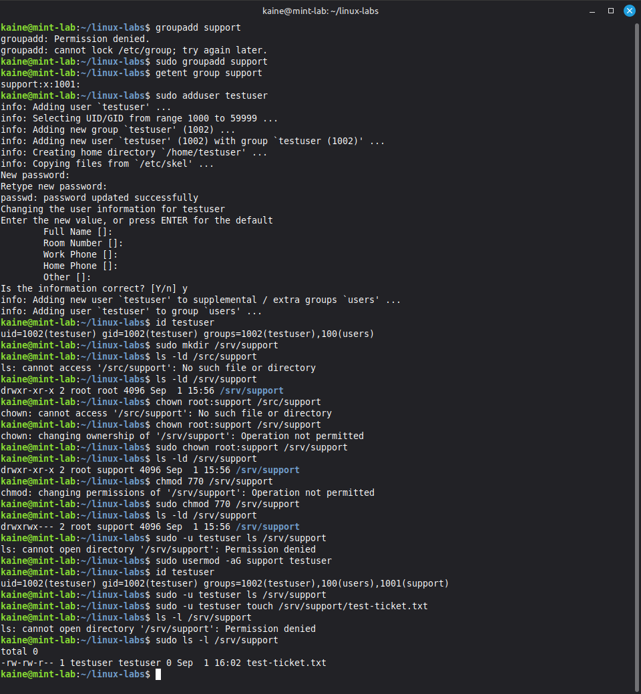
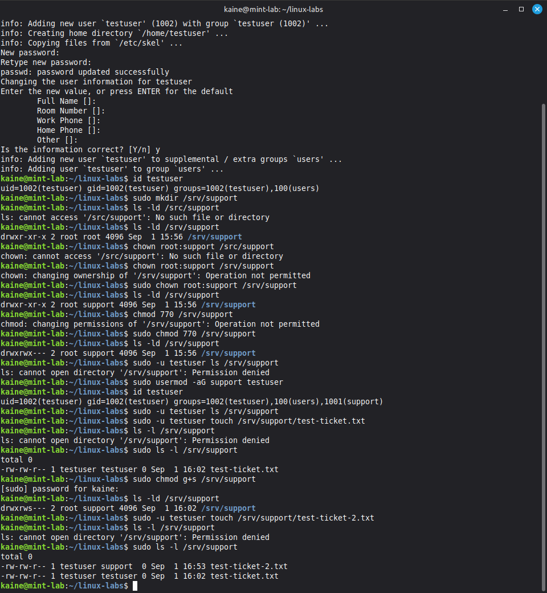
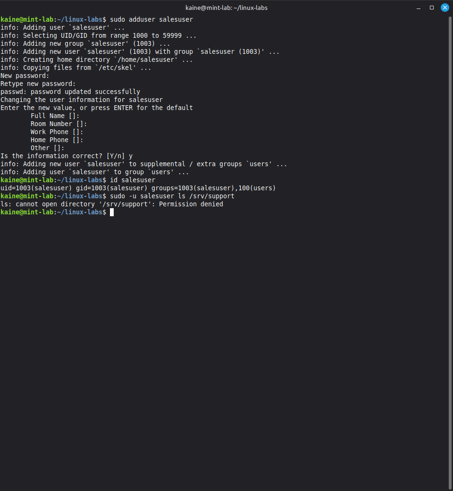
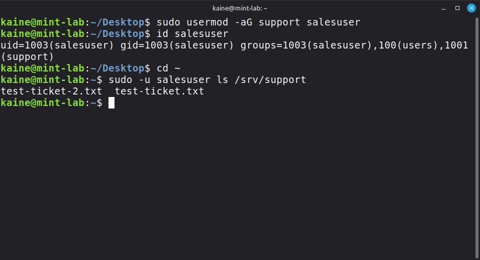

# Linux Permissions & User Access Control Lab

## Project Overview

This home lab was created to practise Linux command-line administration, file permissions, users, groups and access control.

Rather than only learning individual commands, I created a simulated workplace scenario where a shared Support directory needed to be accessible to authorised users while remaining inaccessible to other users.

The lab covered:

- Linux filesystem navigation
- Creating, copying, moving and deleting files
- Output redirection
- Searching log files with `grep`
- Pipes and command chaining
- Monitoring logs with `tail`
- Symbolic and numeric file permissions
- Executable permissions
- Users and groups
- Ownership
- `sudo` and root privileges
- Group-based access control
- Setgid directories
- Principle of least privilege

## File and Directory Management

I created a working directory called `linux-labs` and practised common filesystem operations.

Commands used included:

```bash
pwd
ls
ls -l
mkdir
touch
cp
mv
rm
find
tree
cat
```

I also practised the difference between relative and absolute paths.

For example:

```bash
cat /home/kaine/linux-labs/notes.txt
```

I used interactive deletion with:

```bash
rm -i notes.txt
```

This prompts for confirmation before deleting the file, providing additional protection against accidental deletion.

## Output Redirection

I practised writing command output into files.

```bash
echo "Linux permissions lab" > notes.txt
```

The `>` operator replaces the existing contents of a file.

I also used:

```bash
echo "Additional text" >> notes.txt
```

The `>>` operator appends data without replacing the existing contents.

## Log Analysis

I created a simulated `system.log` containing INFO and ERROR events and used common Linux tools to analyse it.

To locate errors:

```bash
grep "ERROR" system.log
```

To count the number of matching lines:

```bash
grep "ERROR" system.log | wc -l
```

I also used case-insensitive searching:

```bash
grep -i "error" system.log
```

This matched variations such as:

```text
ERROR
Error
error
```

This demonstrated how command output can be passed into another program using a pipe (`|`).

For example:

```bash
grep -i "error" system.log | wc -l
```

Here, `grep` finds matching log entries and passes its output to `wc`, which counts the resulting lines.

## Monitoring Logs

I used `tail` to inspect the most recent entries in a log:

```bash
tail system.log
tail -n 2 system.log
```

I then used:

```bash
tail -f system.log
```

to monitor the file continuously.

From another terminal I added a new log entry:

```bash
echo "ERROR SSH authentication failed" >> system.log
```

The new entry immediately appeared in the monitoring terminal.

This demonstrated how `tail -f` can be used to observe logs in real time while troubleshooting a system or service.

## Linux File Permissions

I examined permissions using:

```bash
ls -l
```

Linux permissions are divided between:

- User/owner (`u`)
- Group (`g`)
- Others (`o`)

The available permissions are:

- Read (`r`)
- Write (`w`)
- Execute (`x`)

I practised modifying permissions symbolically.

Examples included:

```bash
chmod g-w notes.txt
chmod o+w notes.txt
chmod o-rw notes.txt
chmod u-w notes.txt
chmod u+w notes.txt
```

After removing my own write permission, attempting to append data to the file resulted in:

```text
Permission denied
```

Restoring owner write permission allowed the file to be modified again.

## Numeric Permissions

I also practised octal permission notation.

The permission values are:

```text
4 = read
2 = write
1 = execute
```

For example:

```bash
chmod 640 notes.txt
```

results in:

```text
Owner:  read + write
Group:  read
Others: no permissions
```

Other examples:

```text
600 = owner read/write only
755 = owner read/write/execute, group and others read/execute
```

## Executable Permissions

I created a simple Bash script:

```bash
echo 'echo "Hello from my first Bash script"' > hello.sh
```

Attempting to execute it initially failed because the file did not have execute permission.

I corrected this with:

```bash
chmod u+x hello.sh
```

The script could then be executed with:

```bash
./hello.sh
```

This demonstrated that possessing read/write access to a script does not automatically make it executable.

## sudo and Root Privileges

I examined my current user and group memberships using:

```bash
id
```

I then tested creating a file directly in the root filesystem:

```bash
touch /test-file.txt
```

This returned:

```text
Permission denied
```

because my normal user did not have permission to write directly to `/`.

Running:

```bash
sudo touch /test-file.txt
```

successfully created the file as `root`.

This demonstrated how `sudo` allows an authorised user to execute a specific command with elevated privileges.

It also reinforced why administrative privileges should only be used when necessary. Running every command as root would remove many of Linux's protections against accidental or unauthorised system changes.

## Shared Support Directory Scenario

I created a simulated workplace scenario where members of a Support team required access to a shared directory.

A new group called `support` was created and a shared directory was configured:

```bash
sudo groupadd support
sudo mkdir /srv/support
sudo chown root:support /srv/support
sudo chmod 770 /srv/support
```

The resulting permissions allowed:

```text
Owner (root):     read, write, execute
Group (support):  read, write, execute
Others:           no access
```

This means access could be controlled through group membership rather than giving permissions to individual users.

## Testing Access Control

I created a test user who was initially not a member of the `support` group.

Attempting to access the directory as that user resulted in:

```text
Permission denied
```

I then added the user to the Support group:

```bash
sudo usermod -aG support testuser
```

After verifying membership with:

```bash
id testuser
```

the user could access `/srv/support`.

This demonstrated group-based access control: the directory permissions remained unchanged while access was granted by changing the user's group membership.

## Setgid and Group Inheritance

When `testuser` initially created a file inside `/srv/support`, the new file inherited the user's primary group rather than the `support` group.

For a shared team directory this could make collaboration more difficult.

I enabled the setgid bit on the directory:

```bash
sudo chmod g+s /srv/support
```

The directory permissions then included:

```text
drwxrws---
```

A new file created inside the directory inherited the `support` group.

This means files created by different Support team members can consistently inherit the shared directory's group.

## Simulated Department Transfer

I created another user called `salesuser` to represent an employee outside the Support department.

Because `salesuser` was not a member of the `support` group, attempting to list `/srv/support` resulted in:

```text
Permission denied
```

I then simulated the employee transferring from Sales to Support by adding the account to the existing group:

```bash
sudo usermod -aG support salesuser
```

I verified the change:

```bash
id salesuser
```

The account now included membership of the `support` group.

Without changing the permissions on `/srv/support`, the user could now access the shared Support directory.

This demonstrated how Linux groups can be used to manage access as employee roles change without weakening the permissions of the resource itself.

## Security Principles

### Principle of Least Privilege

Users should receive only the permissions required to perform their role.

The Support directory used:

```text
770
```

rather than granting access to everyone.

### Default Deny

Users outside the authorised `support` group had no access to the directory.

### Group-Based Access Control

Access was assigned to a group rather than configuring permissions separately for every employee.

This makes permissions easier to manage when users join, leave or change roles.

### Verification

Permission changes were tested from the perspective of different user accounts rather than assuming that a configuration change had worked.

## Lab Cleanup

The temporary users, group and shared directory were created only for the lab.

After testing was complete, they could be removed using administrative commands such as:

```bash
sudo deluser --remove-home testuser
sudo deluser --remove-home salesuser
sudo rm -r /srv/support
sudo groupdel support
```

This keeps the workstation clean and prevents unnecessary test accounts or permissions remaining on the system.

## Skills Demonstrated

This lab provided hands-on practice with:

- Linux command-line navigation
- File and directory management
- Linux permissions
- Symbolic and octal `chmod`
- Users and groups
- File and directory ownership
- `sudo`
- Principle of least privilege
- Group-based access control
- Setgid directories
- Log searching with `grep`
- Pipes and output redirection
- Real-time log monitoring with `tail -f`
- Testing and verifying access controls
- Basic Bash script permissions
- Troubleshooting `Permission denied` errors

## Key Lessons

Linux permissions are easier to understand when viewed as an access-control system rather than simply memorising `chmod` commands.

The shared Support directory demonstrated how ownership, groups and permissions work together. Instead of weakening the directory permissions when another employee required access, I changed the user's group membership.

The lab also demonstrated the importance of testing security controls from the perspective of both authorised and unauthorised users.

A successful command does not necessarily prove that an access-control configuration is correct; testing both allowed and denied access provides much stronger verification.

## Evidence

The following screenshots document the practical access-control tests performed during the lab.

### Shared Support Directory Configuration



*Creating the `support` group and shared `/srv/support` directory, configuring ownership and `770` permissions, and testing access with `testuser`. The screenshot shows access being denied before group membership was granted and successful file creation afterwards.*

### Setgid Group Inheritance



*Testing file ownership inside the shared directory. The first file initially inherited the user's primary group. After enabling setgid on `/srv/support`, newly created files inherited the `support` group, making the directory more suitable for team collaboration.*

### Unauthorised User Access Test



*The `salesuser` account is shown without membership of the `support` group. Attempting to access `/srv/support` results in `Permission denied`, verifying that users outside the authorised group cannot access the directory.*

### Department Transfer and Access Granted



*Simulating an employee transferring departments. `salesuser` is added to the `support` group and the new membership is verified using `id`. The same account can then successfully list the contents of `/srv/support` without changing the directory's existing permissions.*

## Outcome

The lab successfully demonstrated a simple role-based access-control model using standard Linux users, groups and filesystem permissions.

An unauthorised account was prevented from accessing the shared Support directory, while authorised users received access through membership of the `support` group.

When a user's role changed, access could be granted by updating group membership rather than weakening the permissions on the protected directory.

Using setgid also ensured that new files created within the shared directory inherited the appropriate team group.

This provided practical experience with configuring, testing and troubleshooting Linux permissions in a scenario similar to user and shared-resource administration in an IT support environment.
