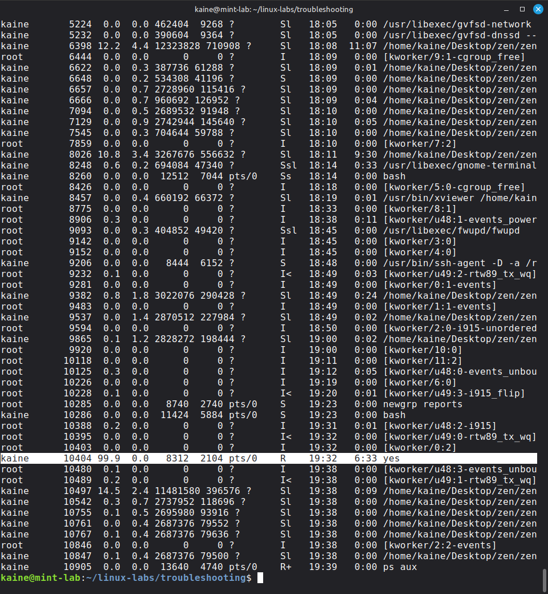
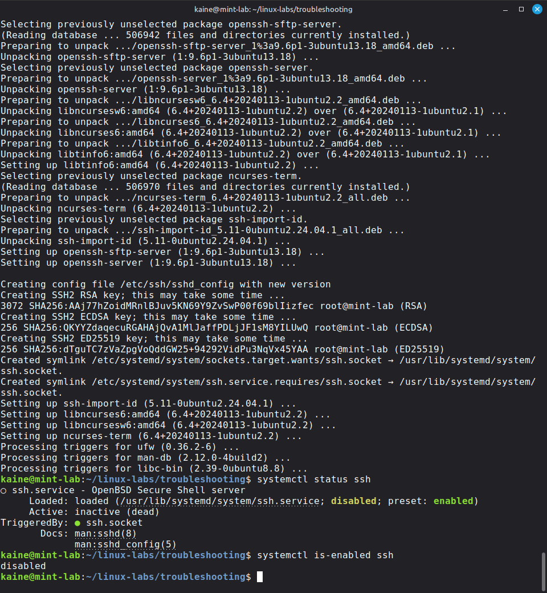
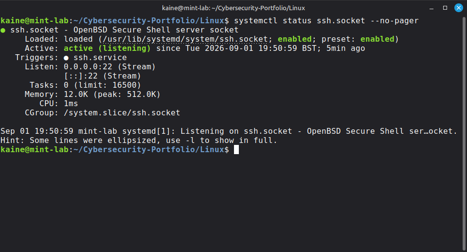

# Linux Process & Service Troubleshooting Lab

## Project Overview

This home lab focused on diagnosing Linux performance and service issues using command-line tools.

I worked through two simulated IT support scenarios:

1. Investigating a process causing unusually high CPU usage
2. Investigating why SSH appeared to be inactive

The goal was to practise identifying the cause of a problem before making changes.

## Process Investigation

I first examined running processes using:

```bash
ps aux
```

and:

```bash
htop
```

This allowed me to inspect process IDs (PIDs), CPU usage, memory usage and process names.

A PID uniquely identifies a running process and can be used when inspecting or managing that specific process.

## Simulated High CPU Usage

I deliberately created a CPU-intensive process:

```bash
yes > /dev/null &
```

I then investigated the running processes and identified `yes` consuming approximately 100% of a CPU core.

Rather than terminating processes based only on high resource usage, I first confirmed the process name and PID.

I searched for the process using:

```bash
ps aux | grep "yes"
```

## Process Termination

Once the problematic process had been identified, I terminated the specific PID using:

```bash
kill <PID>
```

By default, `kill` sends SIGTERM, allowing the process to terminate normally.

I then verified that the process was no longer running.

I also learned that:

```bash
kill -9 <PID>
```

sends SIGKILL, which immediately terminates a process and should generally be reserved for situations where normal termination fails.

This demonstrated the troubleshooting sequence:

```text
Observe → Identify → Act → Verify
```

## SSH Service Investigation

I then simulated an SSH connectivity investigation.

Checking:

```bash
systemctl status ssh
```

initially showed that `ssh.service` could not be found because the OpenSSH server was not installed.

This highlighted the difference between:

- `openssh-client` — allows the workstation to connect to SSH servers
- `openssh-server` — allows remote systems to connect to the workstation

I installed the SSH server package and checked its status again.

```bash
systemctl status ssh
```

The result showed:

```text
Loaded: loaded
Active: inactive (dead)
TriggeredBy: ssh.socket
```

At first, the inactive service could appear to indicate that SSH was unavailable.

## Socket Activation

I investigated further by checking:

```bash
systemctl status ssh.socket
systemctl is-enabled ssh.socket
```

The SSH socket was active and enabled.

This demonstrated systemd socket activation. The system can listen for incoming SSH connections using `ssh.socket` and start the SSH service when a connection requires it.

Therefore, an inactive `ssh.service` did not by itself mean that SSH connectivity was unavailable.

## Skills Demonstrated

- Linux process investigation
- `ps`
- `htop`
- Process IDs
- CPU and memory analysis
- Pipes and `grep`
- SIGTERM and SIGKILL
- Process termination
- `systemctl`
- Linux service troubleshooting
- OpenSSH client/server concepts
- systemd socket activation
- Evidence-based troubleshooting
- Verification after making changes

## Key Lessons

High CPU or memory usage does not automatically mean a process should be terminated. Processes should first be identified and their purpose understood.

I also learned not to rely on a single service status when diagnosing a problem. Although `ssh.service` appeared inactive, further investigation showed that `ssh.socket` was active and listening for connections.

The main troubleshooting approach reinforced by this lab was:

**Observe the symptoms, gather evidence, identify the cause, make a targeted change, and verify the result.**

## Evidence

### High CPU Process Investigation



*The `yes` process was identified consuming approximately 100% of a CPU core before being terminated and verified.*

### SSH Service Investigation



*OpenSSH Server was installed and `ssh.service` was found to be inactive but triggered by `ssh.socket`.*

### SSH Socket Verification



*Further investigation confirmed that `ssh.socket` was enabled and actively listening on port 22, demonstrating systemd socket activation.*
