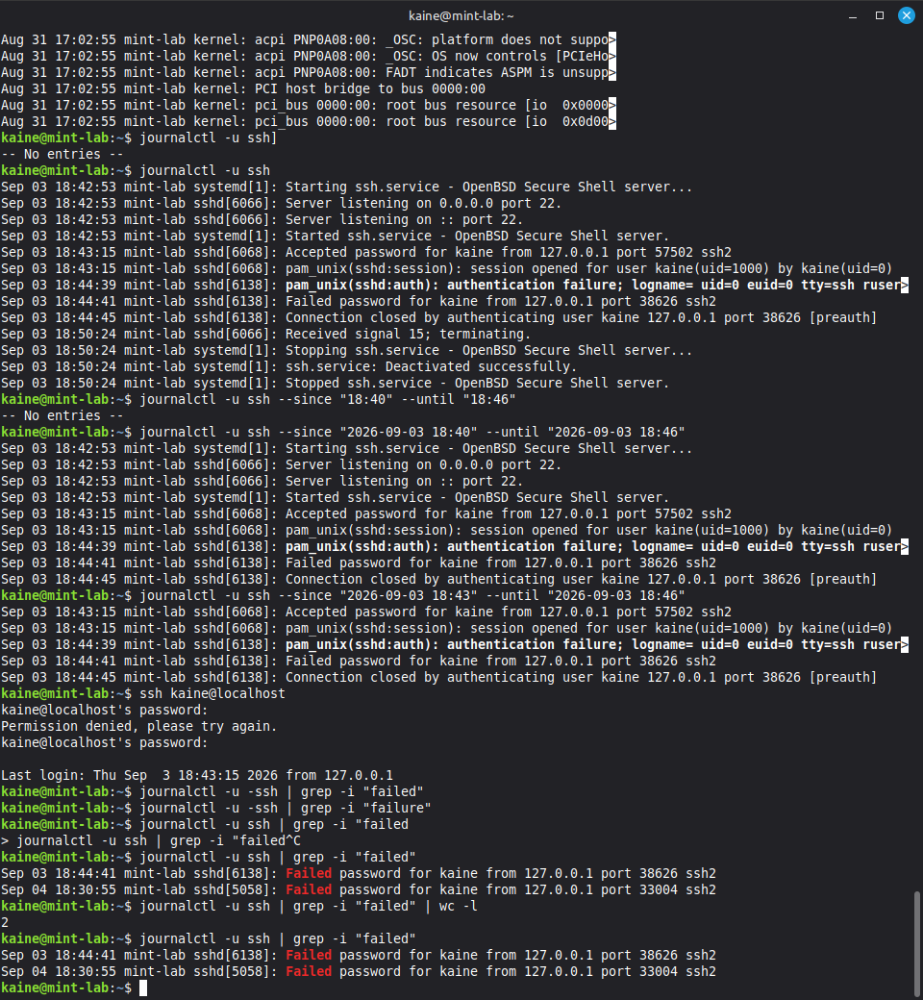
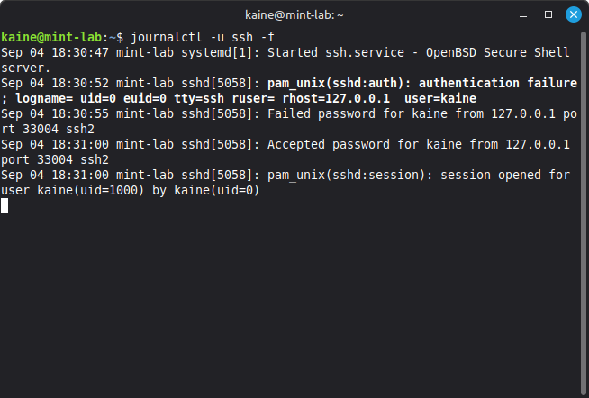

# Linux SSH Authentication Log Investigation

## Overview

This project documents a practical investigation of SSH authentication activity on my Linux Mint system.

The aim was to learn how successful and failed authentication attempts are recorded, how Linux logs can be filtered to locate relevant events, and how the available evidence can be used to assess whether authentication activity appears suspicious.

## Environment

- Linux Mint
- OpenSSH Server
- systemd journal
- Local SSH connections using localhost

## Tools and Commands Used

- `/var/log/auth.log`
- `grep`
- `journalctl`
- `wc`
- Linux pipes (`|`)
- SSH

## Investigation

### Initial Authentication Log Review

I began by reviewing:

```bash
/var/log/auth.log
```

Because the authentication log contained a large number of entries, I used `grep` to search for potentially relevant authentication events.

An initial search for general errors produced unrelated entries, demonstrating that broad searches can introduce noise into an investigation.

I progressively narrowed the search to failed authentication activity and SSH events.

### Generating Known SSH Events

To understand how SSH authentication appeared in the logs, I generated controlled authentication activity by connecting to the local SSH server:

```bash
ssh kaine@localhost
```

I generated both:

- A successful SSH authentication
- A deliberately failed SSH authentication using an incorrect password

This provided known events that could then be located and analysed in the system logs.

### Investigating with journalctl

I used the systemd journal to isolate events generated by the SSH service:

```bash
journalctl -u ssh
```

This provided a more focused view than examining the complete system journal.

I also used time filtering to narrow the investigation to a specific period:

```bash
journalctl -u ssh --since "YYYY-MM-DD HH:MM" --until "YYYY-MM-DD HH:MM"
```

This demonstrated the importance of selecting the correct date and time range during log analysis.

### Live Log Monitoring

I monitored SSH activity in real time using:

```bash
journalctl -u ssh -f
```

While monitoring the journal, I generated another failed authentication followed by a successful login.

The logs showed events including:

- PAM authentication failure
- Failed SSH password authentication
- Accepted SSH password
- PAM session opened

This demonstrated how authentication and session creation can be observed as separate events.

### Filtering Failed Authentication Events

I combined `journalctl`, `grep` and Linux pipes to isolate failed SSH events:

```bash
journalctl -u ssh | grep -i "failed"
```

I then counted the matching entries:

```bash
journalctl -u ssh | grep -i "failed" | wc -l
```

Two failed SSH authentication entries were identified.

## Findings

The investigation identified two failed SSH authentication attempts:

| Date | Time | Username | Source IP | Source Port |
|------|------|----------|-----------|-------------|
| 3 September | 18:41:41 | kaine | 127.0.0.1 | 38626 |
| 4 September | 18:30:55 | kaine | 127.0.0.1 | 33004 |

Both events:

- Targeted the `kaine` account
- Originated from `127.0.0.1`
- Were isolated events rather than rapid repeated attempts
- Were followed by successful authentication

The source address `127.0.0.1` is the loopback address, indicating that the authentication attempts originated from the local machine.

## Analysis and Conclusion

The two failed authentication events do not provide strong evidence of malicious activity.

Both attempts originated from the local machine, occurred on separate days, and were followed by successful authentication for the same account.

Based on the low frequency of attempts, local source address and subsequent successful logins, the activity is consistent with legitimate password mistyping rather than an attempted brute-force attack or unauthorised remote access.

This investigation also demonstrated that a failed authentication event alone does not necessarily represent a security incident. Context such as source address, frequency, targeted accounts and surrounding authentication activity must be considered before reaching a conclusion.

## Skills Demonstrated

- Linux authentication log analysis
- SSH authentication investigation
- `journalctl` filtering
- Searching logs with `grep`
- Linux command pipelines
- Live log monitoring
- Identifying successful and failed authentication
- Extracting timestamps, usernames, IP addresses and ports
- Correlating related authentication events
- Distinguishing security events from potential incidents
- Evidence-based security analysis

## Evidence

### SSH Journal Investigation



*Reviewing SSH service logs with `journalctl`, filtering by time, identifying successful and failed authentication events, and counting failed SSH attempts.*

### Live SSH Authentication Monitoring



*Monitoring SSH activity in real time with `journalctl -u ssh -f`. The sequence shows a PAM authentication failure, a failed password attempt, a successful password authentication, and the opening of the authenticated user session.*
