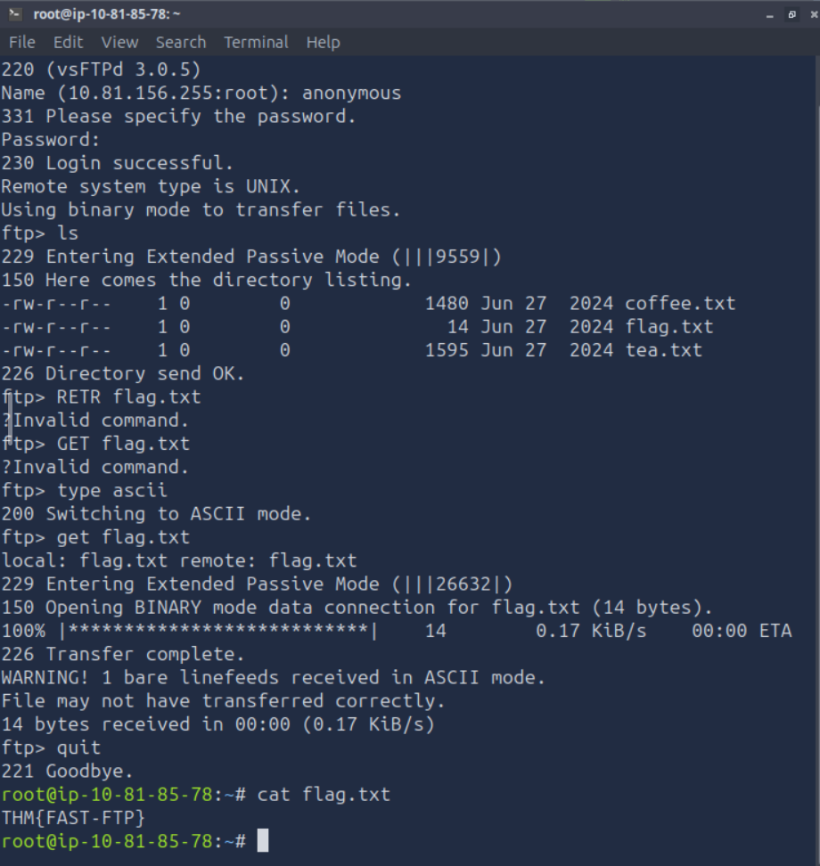
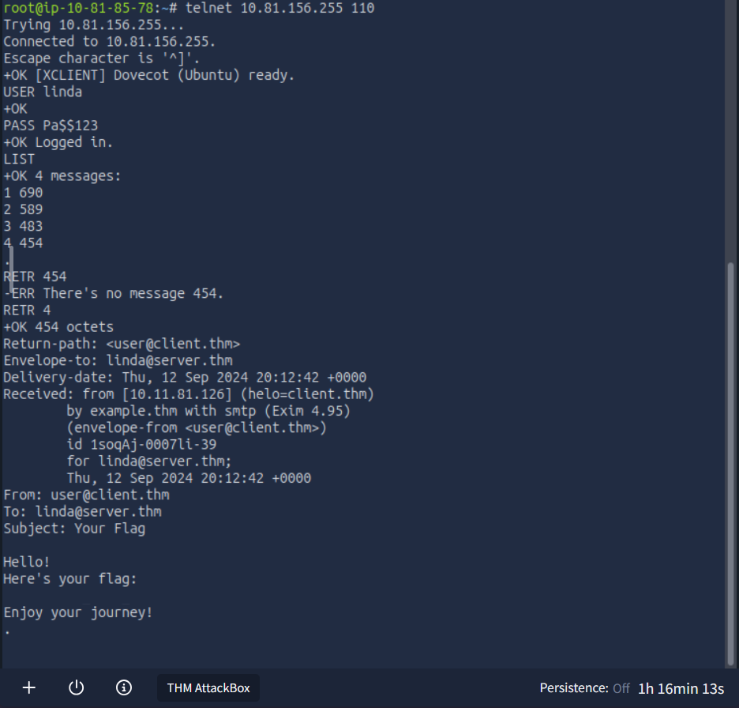

# Networking Core Protocols
## OSI Model

|Layer Number |Layer Name|Main Function|Example Protocols and Standards|
|---|---|---|---|
|Layer 7 |	Application layer |	Providing services and interfaces to applications |	HTTP, FTP, DNS, POP3, SMTP, IMAP|
|Layer 6 |	Presentation layer |	Data encoding, encryption, and compression |	Unicode, MIME, JPEG, PNG, MPEG|
|Layer 5 |	Session layer |	Establishing, maintaining, and synchronising sessions |	NFS, RPC|
|Layer 4 |	Transport layer |	End-to-end communication and data segmentation |	UDP, TCP|
|Layer 3 |	Network layer |	Logical addressing and routing between networks |	IP, ICMP, IPSec|
|Layer 2 |	Data link layer |	Reliable data transfer between adjacent nodes |	Ethernet (802.3), WiFi (802.11)|
|Layer 1 |	Physical layer |	Physical data transmission media |	Electrical, optical, and wireless signals|

### DHCP

### ARP (Address Resolution Protocol)
Address Resolution Protocol (ARP) makes it possible to find the MAC address of another device on the Ethernet. 
If we want to communicate via the data link layer, we can send an ARPRequest to the IP address of the device. The device will then send an ARPReply telling us the MAC address so we can communicate via the data link layer (Layer 2)
ARP allows the translation from Layer 3 (IP) addressing to Layer 2 addressing.

### ICMP (Internet Control Message Protocol)
ICMP is mainly used for network diagnostics and error reporting. Two popular commands rely on ICMP, namely ping and traceroute (Linux, tracert on Windows)

### NAT (Network Address Translation)
NAT was a proposed way to overcome the limits of IPv4 by using a public IP address to provide internet to many private IP addresses.

### DNS
Domain Name Sysytem (DNS) is partly responsible for mapping a domain name to an IP address. It works at Layer 7 of the OSI Model.
A few examples of DNS records are:
* A records
* AAAA records (for IPv6)
* CNAME records, which map domain names to other domain names
* MX records used by mail servers.

**WHOIS** can be used to look up the domain owner and the creation date of any domain. **Note:** Some domains can be created through a service that will redact personal information from the WHOIS records.

**HTTP** 
Designed for retrieving web pages, what browser applications use.
Relies on TCP and uses port 80 by default.

**Telnet:** telnet <ipaddress> <port>
Then use /GET /(filename) /HTTP/1.1
Telnet's default is port 23.

**FTP (File Transfer Protocol)**
FTP is designed to transfer files.
Example commands:
    - USER to input the username.
    - PASS to enter the password.
    - RETR to download a file from the FTP server.
    - STOR to upload a file to the FTP server.
FTP servers listen to TCP port 21 by default.

Here is an example from a Tryhackme room of me downloading a file with FTP:


**SMTP (Simple Mail Transfer Protocol)**
SMTP defines how a mail client talks to a mail server and how mail servers talk to each other.
Example commands:
    - HELO or EHLO initiates an SMTP session.
    - MAIL FROM specifies the senders email address.
    - RCPT TO specifies the recipients email address.
    - DATA indicates that the client will begin sending the content of the email.
    - . is sent by itself to show the end of the message.
SMTP servers listen to TCP port 25 by default.

**POP3 (The Post Office Protocol version 3)**
POP3 is designed to allow a mail client to communicate with a mail server and retrieve email messages.
Commom commands:
    - USER <username> identifies the user.
    - PASS <password> gives the password.
    - STAT requests the number of messages and the total size.
    - LIST lists the messages and their sizes.
    - RETR <message_number> gets a specific message.
    - DELE <message_number> marks a message for deletion.
    - QUIT ends the POP3 session applying changes, i.e. deletions.
The POP3 server listen on port 110 by default.



### IMAP (Internet Message Access Protocol)
IMAP allows sychronizing read, moved and deleted messages.
A few example commands (slightly more complicated than POP3):
    - LOGIN <username> <password> authenticates the user
    - SELECT <mailbox> selects the mailbox folder to work with
    - FETCH <mail_number> <data_item_name> Example fetch 3 body[] to fetch message number 3, header         and body.
    - MOVE <sequence_set> <mailbox> moves the specified messages to another mailbox
    - COPY <sequence_set> <data_item_name> copies the specified messages to another mailbox
    - LOGOUT logs out
IMAP server listens to Port 143 by default.

# Networking Secure Protocols
The above protocols do not protect the confidentiality, integrity or authenticity of the data that is sent over them. **Transport Layer Security (TLS)** is added to existing protocols to protect the CIA triad.

## TLS
TLS allows secure communication between devices over an insecure network. 
A server or client needs a signed TLS certificate to be trusted as secure.

### HTTPS
HTTPS works similarly to HTTP but a TLS session is established after the TCP three-way handshake.
After this, all of the data in the packets appears as giberish if intercepted, unless you have the encryption key.

### SMTPS, POP3S, IMAPS
These all work in the same way as HTTPS did over TLS.
|---|---|
|**Protocol**|**Default Port Number**|
|HTTPS|443|
|SMTPS|465 or 587|
|POP3S|995|
|IMAPS|993|

## SSH
Telnet is risky as all the traffic is sent in cleartext. 
SSH offers confidentiality, integrity along with other benefits of having the traffic encrypted.
Use the command ```bash ssh username@hostname ``` to connect to an SSH server. You will then be asked for a password, unless the server uses public-key authentication.
The SSH server listens on port 22.

### SFTP
SFTP or SSH File Transfer Protocol allows secure file transfer. It can be enabled in the OpenSSH server configuration and allows for commands such as ```bash get filename ``` and ```bash put filename ``` to download and upload files respectively.

## VPN (Virtual Private Network)
Can be used to connect devices in different locations as if they were physically located in the same place.
All the internet traffic is sent from a VPN client to a VPN server, which then sends on the traffic from its IP address and back to the VPN client. This is why many people use VPN's for privacy and circumventing geographical restrictions.
